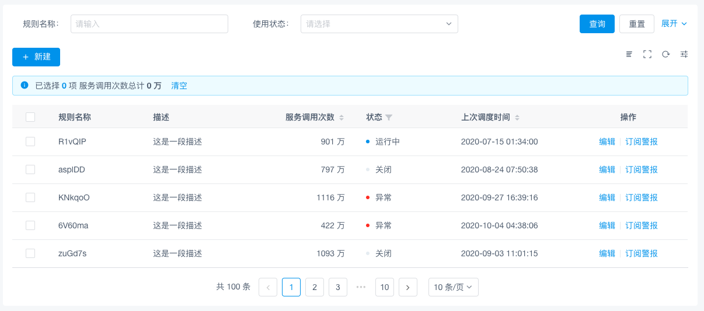
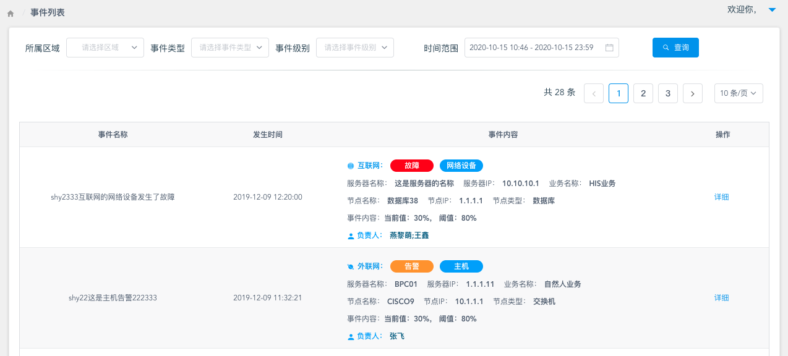
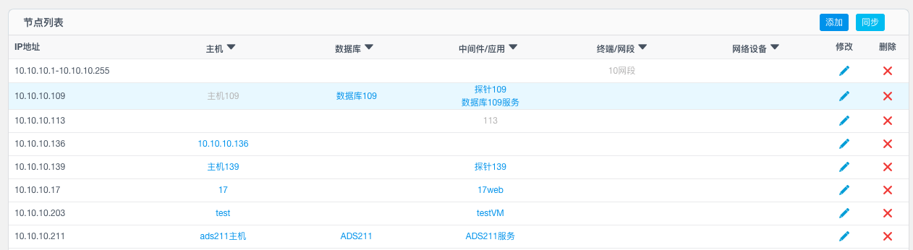

# 界面规范

## 参考

### 基础组件

1. 默认采用[iview](https://www.iviewui.com/)提供的组件

2. 如果IVIEW中的字体图标不够用，使用

### 整体风格

1. [iviewadmin](https://adminpro.iviewui.com/login)

2. [bootstrap]( http://cn.inspinia.cn/)

3. [bpc](http://10.10.10.76/)
4. [统一告警平台](http://10.10.10.76:8449/)

## 列表

### 推荐

1. 

* 上部分查询条件可以根据需要展开和收起

* 使用开放式表格（没有太多边框），透气性好

* 操作使用文字时，用”|“分隔，并保持间距

  

2. 

* 如果要展示的列特别多，可以使用不同的前置图标或者颜色，把内容分类展示

### 避免

* 高度太紧促
* 排序图标、删除图标比较突兀
* 行和列不知所云

